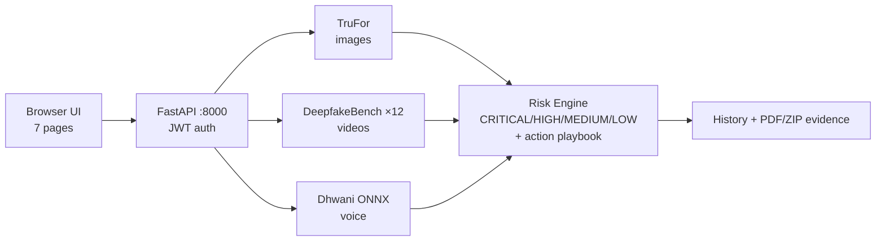

<div align="center">


# 🛡️ VAJRA Trust Intelligence

[](https://github.com/KRISHNA0R/VAJRA-Trust-Intelligence)

[](https://github.com/KRISHNA0R/VAJRA-Trust-Intelligence)
[](https://github.com/KRISHNA0R/VAJRA-Trust-Intelligence)
[](https://www.python.org/)
[](https://github.com/KRISHNA0R/VAJRA-Trust-Intelligence)
[](docs/handover/LICENSE)
[](https://github.com/KRISHNA0R/VAJRA-Trust-Intelligence)

### 🎯 Deepfake Detection for Financial Communications

*Help people and institutions **verify** financial communications, **detect** manipulation, and get an **actionable path** for review, reporting, and response.*

</div>

---

## ⚡ What is VAJRA?

Every day, fake images, doctored videos and **cloned voices** scam people and institutions —
fake CEO voice notes, morphed payment screenshots, manipulated KYC videos.
**VAJRA Trust Intelligence** is a locally-running forensic workstation that tells you,
with evidence, whether a piece of media is **REAL or FAKE** — and exactly **what to do next**.

| | Capability | Engine | Status |
|---|---|---|---|
| 🖼️ | Image forgery detection + pixel-level localization + heatmaps | **TruFor** | ✅ Verified |
| 🎬 | Video deepfake detection (12 models) + suspicious segments + keyframes | **DeepfakeBench** | ✅ Verified |
| 🎙️ | Voice spoof detection — Hindi, English, Tamil, Telugu, Malayalam | **Dhwani** (XLS-R + AASIST) | ✅ 4/4 Verified |
| 🛡️ | Financial risk level + response playbook on every result | **Risk Engine** | ✅ Verified |
| 📄 | One-click forensic PDF + ZIP evidence packages | reportlab + zip | ✅ Verified |
| 📜 | Detection history with verdict / risk / score tracking | built-in | ✅ Verified |

---

## 🏆 Team HACKSTREET — RAKSHAM PS3

| Member | Role | Owns |
|---|---|---|
| **KRISHNA R** | 🧠 Team Lead · Backend & AI Systems | FastAPI core, model integration, architecture |
| **KRRISH KUMAR** | 🎨 Frontend & UI/UX Engineer | Web UI, orange theme, result visualizations |
| **AFFAN LATIF** | 🎙️ ML Engineer · Voice Forensics | Dhwani voice pipeline, audio validation |
| **RITIK RAUSHAN** | 🔒 Security & QA Engineer | Auth hardening, testing, evidence reports |

> **Problem Statement 3 — Deepfake Detection for Financial Communications.**
> Built for the RAKSHAM AI Cybersecurity Hackathon.

---

## 🖥️ Live Demo (2 minutes)

```bash
# 1. Start the backend (serves API + UI together — no Docker, no build step)
$env:PYTHONIOENCODING = "utf-8"
python -m uvicorn app.main:app --host 127.0.0.1 --port 8000

# 2. Open the app
http://localhost:8000/web/index_main.html   # Register → Login (admin/admin123 for demo)
```

👉 **Follow the demo:** [`VIDEO_SCRIPT_YT.md`](VIDEO_SCRIPT_YT.md) — timestamped 2-minute
 walkthrough (login → image → video → voice → reports).

---

## 🧠 How it works



📐 Full as-built diagram: [`docs/architecture/vajra_end_to_end_architecture.md`](docs/architecture/vajra_end_to_end_architecture.md)

<details>
<summary><b>🔬 Model details (click to expand)</b></summary>

| Model | Task | Source | Weights |
|---|---|---|---|
| TruFor `detconfcmx` | Image forgery + localization | [grip-unina/TruFor](https://github.com/grip-unina/TruFor) | `models/trufor.pth.tar` (~268 MB) |
| DeepfakeBench ×12 | Video (Xception, Meso-4, F3Net, EfficientNet-B4, Capsule, SRM, RECCE, SPSL, UCF, CNN-AUG, CORE…) | [SCLBD/DeepfakeBench](https://github.com/SCLBD/DeepfakeBench) | `models/vendors/…/weights/` (13 files) |
| Dhwani | Multilingual voice spoof (en/hi/ta/te/ml) | [HuggingFace](https://huggingface.co/ayush2635/Dhwani-Multilingual-Deepfake-Audio-Detection-Model) (MIT) | `models/audio_dhwani/best_model.onnx` (~1.26 GB) |

> We **integrate** these models — we did not train them. All credit to the original authors.
> Technical model names are intentionally unchanged. Weights are gitignored, never committed.

</details>

<details>
<summary><b>✅ Verified results (click to expand)</b></summary>

| Test | Result |
|---|---|
| Image (TruFor, live API) | REAL, integrity 0.64 + heatmaps |
| Video (xception, 20 frames, CPU) | 1 segment, ~16 s |
| Voice EN real / HI real (FLEURS) | REAL 0.04% / 0.02% |
| Voice EN fake / HI fake (MMS-TTS) | FAKE 78% / 99% |
| History + PDF (`%PDF-`) + ZIP (`PK`) | HTTP 200, valid files |
| Risk engine | FAKE→CRITICAL + 5 actions, in API + UI + PDF |

Full evidence log: [`VAJRA_SETUP_READINESS_REPORT.md`](VAJRA_SETUP_READINESS_REPORT.md)

</details>

---

## 🚀 Setup

<details open>
<summary><b>1️⃣ Dependencies (Windows native, no Docker needed)</b></summary>

```powershell
python -m venv venv; .\venv\Scripts\Activate.ps1
pip install fastapi "uvicorn[standard]" python-dotenv python-multipart `
  torch torchvision opencv-python pillow numpy tqdm yacs timm scipy `
  scikit-image pyyaml aiofiles matplotlib "python-jose[cryptography]==3.3.0" `
  "passlib[bcrypt]==1.7.4" "bcrypt==3.2.0" "reportlab==4.0.7" httpx pytest `
  simplejson fvcore iopath av scikit-learn albumentations tensorboard omegaconf `
  efficientnet-pytorch lmdb pretrainedmodels kornia loralib transformers einops `
  imgaug gdown onnxruntime soundfile datasets huggingface_hub
winget install -e --id Gyan.FFmpeg   # test-media generation
```

</details>

<details>
<summary><b>2️⃣ Model weights (one-time download, ~2.7 GB total)</b></summary>

```powershell
# Image + video weights (Google Drive)
gdown --folder "https://drive.google.com/drive/folders/117IJoriB7kJB9vWQOuj7_S6lNRSOyZ_A" -O models_dl --continue
Expand-Archive "models_dl\TruFor_weights.zip" -DestinationPath "models" -Force
Expand-Archive "models_dl\vendors.zip" -DestinationPath "models" -Force
Copy-Item models\weights\trufor.pth.tar models\trufor.pth.tar

# Voice model (Hugging Face)
python -c "from huggingface_hub import snapshot_download; snapshot_download('ayush2635/Dhwani-Multilingual-Deepfake-Audio-Detection-Model', local_dir='models/audio_dhwani')"
```

</details>

<details>
<summary><b>3️⃣ Run + verify</b></summary>

```powershell
Copy-Item .env.example .env   # then set a real JWT_SECRET_KEY inside
$env:PYTHONIOENCODING = "utf-8"
python -m uvicorn app.main:app --host 127.0.0.1 --port 8000
# UI: http://localhost:8000/web/index_main.html | API docs: http://127.0.0.1:8000/docs
python audio_verify.py        # voice check, expects PASS 4/4 (no server needed)
```

</details>

---

## 🛡️ PS3 mapping — verify · detect · respond

| PS3 ask | VAJRA answer |
|---|---|
| Verify financial communications | Upload any image / video / voice clip → REAL-or-FAKE verdict with confidence |
| Detect manipulation | Pixel heatmaps (images), suspicious segments + keyframes (video), windowed spoof scores (voice) |
| Actionable review path | History with verdict / risk / score + analyst workflow |
| Actionable reporting path | One-click forensic PDF + ZIP evidence package (includes risk + actions) |
| Actionable response path | Risk levels CRITICAL/HIGH/MEDIUM/LOW, each with a concrete playbook (callback verification, quarantine, fraud-desk escalation…) |

---

## ⚠️ Know before you deploy

- CPU-only inference (GPU untested) · Python 3.14 needs 2 tiny documented shims (`tools/build_dfbench_model.py`)
- Change `JWT_SECRET_KEY` + the seeded `admin/admin123` before any shared use
- `dlib` intentionally not installed (training-only dep, stubbed) · Docker kept as untested fallback
- Use only consented/public media for testing · dev server stays on `127.0.0.1`

---

<div align="center">

**🛡️ VAJRA Trust Intelligence** · *Verification & AI-based Judgement for Risk Assessment*

Built with 🔥 by **TEAM HACKSTREET** — KRISHNA R · KRRISH KUMAR · AFFAN LATIF · RITIK RAUSHAN

*Don't trust the clip. **Verify it.***

</div>
