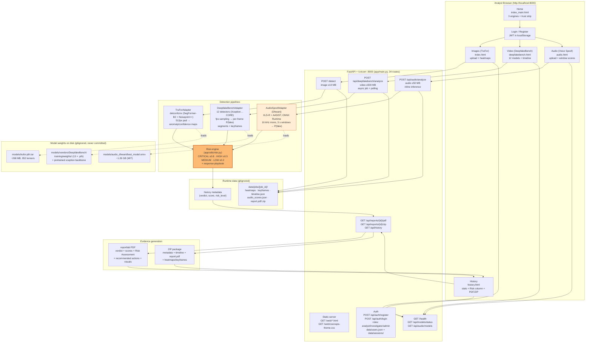

# VAJRA Trust Intelligence — End-to-End System Architecture

**Status:** as-built, October 2026. Single-machine native run (Windows 11, Python 3.14, CPU-only).
`Verification & AI-based Judgement for Risk Assessment` · RAKSHAM PS3.

## Component map

| Layer | Component | File(s) | Notes |
|---|---|---|---|
| UI | 7 pages, vanilla JS + DaisyUI CDN | `app/web/*.html`, `app/web/css/vajra-theme.css` | Same-origin `fetch` — no CORS; orange theme, black-text fixes |
| API | FastAPI app, 34 routes | `app/main.py` | Serves UI + API on `:8000`; `PYTHONIOENCODING=utf-8` on Windows |
| Auth | JWT, 3 roles, seeded `admin/admin123` | `app/auth/`, `data/users.json` | Rotate `JWT_SECRET_KEY` (see `.env.example`) before shared use |
| Image | TruFor adapter | `app/adapters/trufor_adapter.py`, `TruFor-main/` | Anomaly + confidence + Noiseprint++ maps per job |
| Video | DeepfakeBench adapter | `app/adapters/deepfakebench_adapter.py`, `tools/build_dfbench_model.py` | dlib stub + `np.sctypes` shim for Py3.14 (training-only deps) |
| Audio | Dhwani ONNX adapter | `app/adapters/audio_adapter.py` | FFmpeg fallback decode; validated 4/4 HI+EN |
| Risk | Level + playbook | `app/utils/risk.py` | Attached in API, history, PDF, and all 3 result UIs |
| Reports | PDF + ZIP | `app/reports/` | Risk section included; `%PDF-`/`PK` verified |
| Data | Jobs + history JSON | `data/jobs/`, `data/*.json` | Gitignored; wipe via `scripts/clean_test_data.ps1` (review first) |
| Tests | Smoke + fixtures | `api_smoke.py`, `report_smoke.py`, `audio_e2e.py`, `audio_verify.py`, `test_*.wav` | Rerunnable verification |

## Key request flows

1. **Image:** Browser → `POST /detect` → TruForAdapter → heatmaps to `data/jobs/{id}/` → risk attach → JSON (verdict, maps, risk, actions) → history + UI render.
2. **Video:** Browser → `POST /api/deepfakebench/analyze` → `{job_id}` immediately → ThreadPool worker (model load ~1 min first time) → progress via `progress.json` polling → segments/keyframes/`timeline.json` → risk attach → UI timeline + History.
3. **Audio:** Browser → `POST /api/audio/analyze` → Dhwani ONNX (seconds, CPU) → window scores → risk attach → UI verdict + actions + History.
4. **Evidence:** History → `GET /api/reports/{id}/pdf|zip` → generated on first request, then served.

## Verified numbers (this build)

- Image: REAL 0.64 integrity (live API) · Video: 20 frames / 15.6 s CPU · Audio matrix 4/4 (REAL 0.0002–0.0004, FAKE 0.78–0.99) · PDF 1.39 MB · ZIP 1.12 MB · all pages HTTP 200.
